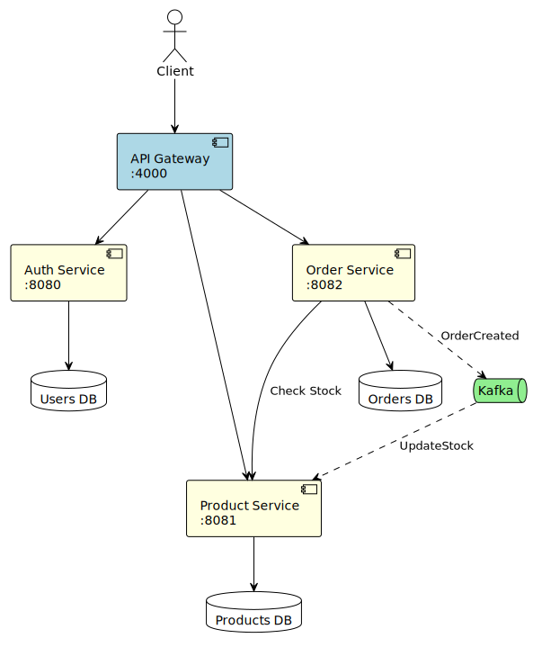
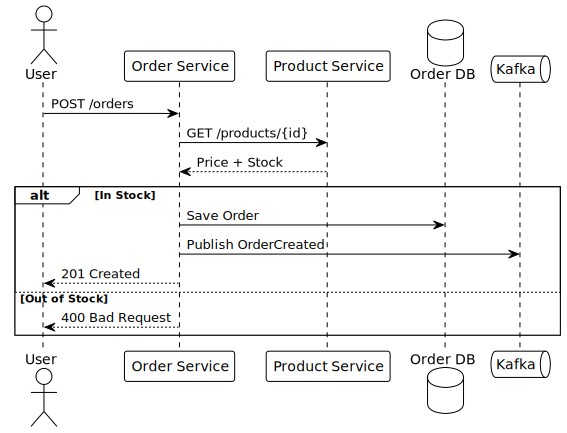
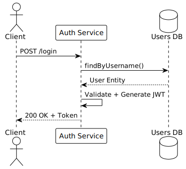

# Ecommerce Microservices Platform

A robust, **event-driven** e-commerce backend built with **Java 17** and **Spring Boot 3**.

---

## Services Overview

| Service | Port | Database | Description |
|---------|------|----------|-------------|
| **API Gateway** | 4000 | — | Entry point, routes all requests |
| **Auth Service** | 8080 | `usersdb` | Authentication & JWT tokens |
| **Product Service** | 8081 | `productsdb` | Product catalog & stock |
| **Order Service** | 8082 | `ordersdb` | Order management |

---

## System Architecture



**Key Patterns:**
- **Database per Service** – Each microservice owns its data
- **Synchronous Validation** – Order Service checks stock via REST
- **Asynchronous Events** – Kafka for eventual consistency

---

## Order Creation Flow



---

## Authentication Flow



---

## Technology Stack

| Category | Technologies |
|----------|-------------|
| **Core** | Java 17, Spring Boot 3, Spring Cloud |
| **Database** | PostgreSQL 15 (one per service) |
| **Messaging** | Apache Kafka + Zookeeper |
| **Infrastructure** | Docker, Docker Compose |
| **Monitoring** | Prometheus, Grafana |

---

## Quick Start

```bash
# Clone
git clone https://github.com/mnabli94/ecommerce-microservices.git
cd ecommerce-microservices

# Build
mvn clean install -DskipTests

# Run
docker-compose up -d --build
```

---
## Local Development

To run the stack locally without building Docker images.

### PostgreSQL + Kafka (profil `local`)

Runs services against real PostgreSQL databases and Kafka, with Flyway migrations enabled.

**1. Start infrastructure only**

```bash
docker-compose up user-db order-db product-db redis kafka -d
```

| Container | Type | Host port |
|-----------|------|----------|
| `user-db` | PostgreSQL | `5435` → `usersdb` |
| `order-db` | PostgreSQL | `5434` → `ordersdb` |
| `product-db` | PostgreSQL | `5433` → `productsdb` |
| `redis` | Redis | `6379` |
| `kafka` | Kafka | `9092` |

**2. Start the config-server**

```bash
mvn spring-boot:run -pl config-server
```

**3. Start services with the `local` profile**

```bash
mvn spring-boot:run -pl auth-service    -Dspring-boot.run.profiles=local
mvn spring-boot:run -pl product-service -Dspring-boot.run.profiles=local
mvn spring-boot:run -pl order-service   -Dspring-boot.run.profiles=local
```

## Access Points

| Service | URL | Credentials |
|---------|-----|-------------|
| Grafana | http://localhost:3000 | admin / admin |
| Kafka UI | http://localhost:8086 | — |

**API Endpoints:**
- Auth: `http://localhost:4000/api/v1/auth`
- Products: `http://localhost:4000/api/v1/products`
- Orders: `http://localhost:4000/api/v1/orders`